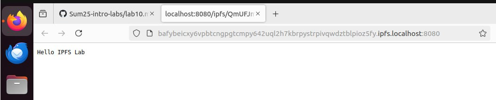
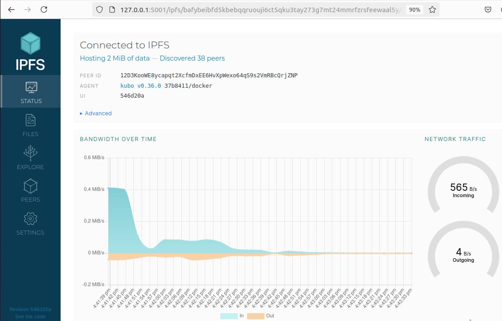
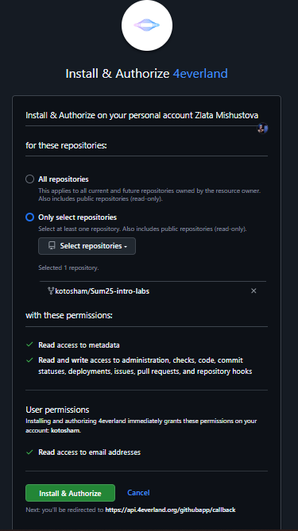
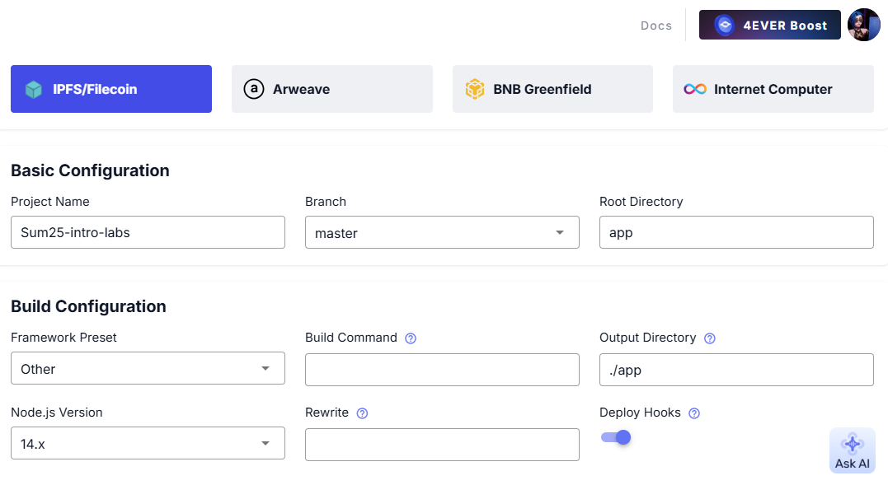
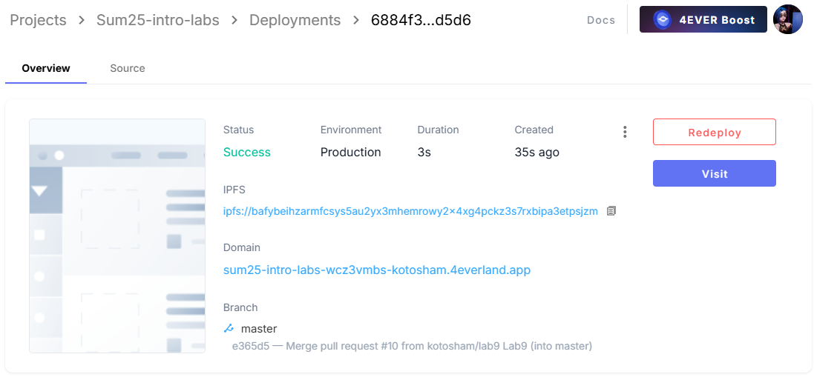
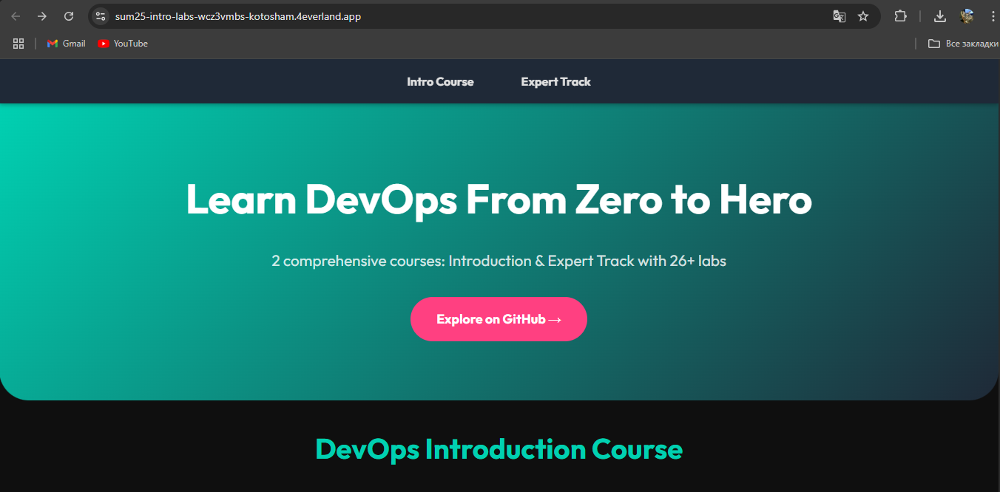

## Task 1. Local IPFS Node Setup and File Publishing
### 1. Starting IPFS container
```sh
docker run -d --name ipfs_node \
  -v ipfs_staging:/export \
  -v ipfs_data:/data/ipfs \
  -p 4001:4001 -p 8080:8080 -p 5001:5001 \
  ipfs/kubo:latest
```
### 2. Verifying node operation
```sh
docker exec ipfs_node ipfs swarm peers
```
```
/ip4/1.251.127.185/tcp/46933/p2p/QmbvJNmKPaRv7PXebFsNjBCvHXkoPhRHR3ZJbTH9NBaT9s
/ip4/101.33.81.69/tcp/39131/p2p/QmXisskEpAPqS2iUh9mXBxjGiH1pk7WpjKMibLMQWvpmCN
/ip4/101.47.182.60/tcp/42107/p2p/QmTYN2VzYDK49UGf9QCe1HWmG5yaevDPyUapmTdRo3ae36
/ip4/104.131.131.82/tcp/4001/p2p/QmaCpDMGvV2BGHeYERUEnRQAwe3N8SzbUtfsmvsqQLuvuJ
/ip4/109.199.117.59/tcp/4001/p2p/QmNs4ejCo54FXdH5va8SRyy7vNoS8NXTQua4fmebSyCQsf
/ip4/109.199.118.199/tcp/4001/p2p/QmPiqF8UihgqYutMtVEzAX25fLfzFPYCj73wcm3Daj3nae
/ip4/109.199.123.18/tcp/4001/p2p/12D3KooWMw577KKMXBPhocXbg95FnbvH1LuiZjyJVmcDZDF1J254
/ip4/116.203.190.64/tcp/4001/p2p/12D3KooWPQuLtZPMJVPmhu6g6Nt7nWQaeQLwN9DcKSyuMUJTKc41
/ip4/124.156.227.184/tcp/38711/p2p/QmaZJkZ8RVQFxjuDcV1MvcP7aZGoumtWvPP3awpn93Gxiv
/ip4/133.242.161.139/tcp/4001/p2p/12D3KooWSkqQXBmULL7pyyoUmfHFMVfwkq7yhdtS1feAAFhg4e6h
/ip4/135.181.78.237/tcp/4001/p2p/12D3KooWCqDAraAJKFgxLymVZhoaEfm8Md7J8EmDJdaF5jgshUAi
/ip4/139.178.91.71/udp/4001/quic-v1/p2p/QmNnooDu7bfjPFoTZYxMNLWUQJyrVwtbZg5gBMjTezGAJN
/ip4/140.235.158.17/udp/4001/quic-v1/p2p/12D3KooWCkbhb6RnHJPHRTQNMQda3qG4P6omzr4WVhW6EgryaKu4
/ip4/144.202.71.34/tcp/4001/p2p/12D3KooWB9Rfe2URtYjPzTQrevGBSYed3jAs5z8aCZ4d84WA4cTt
/ip4/145.40.118.135/tcp/4001/p2p/QmcZf59bWwK5XFi76CZX8cbJ4BhTzzA3gU1ZjYZcYW3dwt
/ip4/146.19.24.157/udp/4001/quic-v1/p2p/12D3KooWM1CrgZE8B9HYSX9bE2bMCjPLjnFavXdXq8tFvg36PZms
/ip4/147.182.148.121/tcp/4001/p2p/12D3KooWJUCBYpVhpQYUF3ahXFaDJPp3TsMpWRaQTExfqfNLcd7M
/ip4/148.113.216.132/tcp/4001/p2p/12D3KooWEmd5WEnZmePV8ebHifdzGevoSz9duSDa23DsAkA2AawE
/ip4/149.102.155.26/udp/4001/quic-v1/p2p/12D3KooWKUjd2M5GEyK7vGnyzT2sFGtNbDVXFoRCDsF2Uj4SxhNm
/ip4/149.28.243.137/tcp/4001/p2p/12D3KooWEtNEGX1LhJbKBsSmsazZzGvwFc6jj1bQnxvh1cnexaf4
/ip4/150.109.230.238/tcp/36057/p2p/QmNefJw2FkitTix2N7pD27Y4WzpQAGakxqKXJrBjyF7WWZ
/ip4/152.53.117.114/tcp/34879/p2p/QmZ95rYVC6UsD9gS1P9c9nFJMqxjC22d8p2yBv2xSRyk3T
/ip4/152.53.162.77/tcp/36653/p2p/QmYSYuxkrxY5QuYMmvQzUnwr2yeGpAYD9rhLTodvbYp9c2
/ip4/152.53.243.110/tcp/40569/p2p/QmNi6yQqnLetcMt26CWUzssn9Eyps6VXxvY5V8iY1eCzDB
/ip4/157.245.109.127/tcp/10017/p2p/QmZa7BS5W81hSkkNeSLpgx1naWgfQNt4ZtK6r2ksj9B3uJ
/ip4/157.90.181.211/tcp/4001/p2p/12D3KooWGaxbu3g9Zhp3B78JtYXPXrUZPwhkLmeaKexrJk4KDFMD
/ip4/158.220.98.162/udp/4001/quic-v1/p2p/12D3KooWQJBeYBnvBeKv8AhUmZH1m5ADzAzdzsfeGpxAtuSD3SEM
/ip4/163.5.63.105/tcp/4001/p2p/12D3KooWCXawWRLhf56ZnsP8wCHhaTGgQPimPJx8yKfEZshggNc3
/ip4/167.99.176.10/tcp/4001/p2p/12D3KooWH7LFmMZSJHFnZPGfZunAP773YctqZQD357KBvchE9y89
/ip4/178.124.208.150/tcp/33495/p2p/QmbDoQRrHbcBREiDQn11xfbX215b9G4ngpaGpJmnjjoDsa
/ip4/178.238.212.239/udp/4001/quic-v1/p2p/12D3KooWA2kJFyx5inDvYHwXMUvPWwNfp8siYrHcHtbkdnUmP51B
/ip4/179.5.95.81/tcp/56720/p2p/12D3KooWDYxGrCLjAJMhjR7fFwcKhbzR6x7iKCzNX6mpmRqY5NCf
/ip4/182.43.103.43/tcp/4001/p2p/12D3KooWAzKcUkzKmudSbAtdgpZEgYTzPEmEmhumNqvKPJBds7C9
/ip4/186.0.207.58/tcp/4001/p2p/QmYbUHvADweHLZmZu9CtmyuKx3z2NHd8nmEfgeWo865ZP6
/ip4/188.240.228.36/udp/4001/quic-v1/p2p/12D3KooWGqwka63KptJR6eRo5PXdoSZWWYPpquD4TuYf1q8wr8LX
/ip4/188.34.177.219/tcp/4001/p2p/QmUEpcrUWd2KaWApD7ssC2QGMdUCN4tUz6fWyN8REDcbPV
/ip4/193.25.216.5/tcp/43051/p2p/QmXWjqshBY1vowxNnv9iW5n16w7a2FeZYkzoHYRfBXy8uG
/ip4/193.58.121.164/tcp/37673/p2p/QmbovFstT7jLwbYq2dh7fNpRdC2i7VFiMfnFFviqhsJfQz
/ip4/193.8.130.160/udp/4001/quic-v1/p2p/12D3KooWNXDBk3oWep8i2WMf4U8mM2u7xdXx7qAX2oVdTWpRbdkn
/ip4/193.84.3.42/udp/4001/quic-v1/p2p/12D3KooWMtiKVPLWC3ZAfT4FcW3gYRvRBmuqyWeTDQBDbLRxwkCM
/ip4/195.26.230.199/udp/4001/quic-v1/p2p/12D3KooWSyfHp8xq9JYDsGUjvo7LzpB7xLhu3pcSEDfsMBNYZLGz
/ip4/195.49.96.165/udp/4001/quic-v1/p2p/12D3KooWJKs8Tz1wyXBb9ZYPBW76pD9wjDL52azDb7pfSxTeNRo6
/ip4/205.209.96.22/udp/4001/quic-v1/p2p/12D3KooWNoLRTeJpyXABQse2uFwdsLrCm9T1eauh16R66rzCzg3M
/ip4/206.189.97.249/tcp/14889/p2p/QmR7Vq6oCYNiN4oYwNFa9Rk9sTFuGvL7aAGW9vEY2cMfbN
/ip4/207.148.113.122/tcp/4001/p2p/12D3KooWSaUg1gmMK9L6dQ4VnLuYf3kfDftGTh3YqZ3hUqNwzQM6
/ip4/208.83.236.133/tcp/4001/p2p/12D3KooWQCiFKq9AUTRuuGhPG8US1verWMEvKSo7tb5G3kKVANiV
/ip4/213.136.92.240/tcp/44381/p2p/QmWjuoREbdgtGxLoKnXCuB8q7qUnBxHYXDjidxMgUA37xg
/ip4/37.252.186.74/udp/4001/quic-v1/p2p/12D3KooWBa6ePJfnv1uaUemvhFvCWaDvqnxb8hZfJp2RP5hkY9Bn
/ip4/40.160.9.115/tcp/4001/p2p/12D3KooWKnDdG3iXw9eTFijk3EWSunZcFi54Zka4wmtqtt6rPxc8
/ip4/43.133.68.12/tcp/43647/p2p/Qmf1zXWzUnMBKMW915J6mdf2fvp9Ncn7TahtuUEEasXMjZ
/ip4/43.133.70.219/tcp/41071/p2p/QmaaaqaTfgprkaXg3eJ9AKSxor75g9pso8zwphKAqkvVs4
/ip4/45.76.27.102/tcp/4001/p2p/12D3KooWN7GC3WM2tiMHTUvwXcezpyYccR7Snu892TUuWhTzhanS
/ip4/45.77.122.52/tcp/4001/p2p/12D3KooWHsyAE9jPsMWvRTvw6k7wy25p4mcfPCF7wgUugfmnSNSD
/ip4/46.17.96.210/udp/4001/quic-v1/p2p/12D3KooWGdKSw9M1KWWrd2p2fgjR7bajnW7crhoAx6qxxFnanQEX
/ip4/46.183.223.4/tcp/4001/p2p/12D3KooWEDgaUU8aVgQz8tJuVfYDLSPNLbz6bLdHioxhH5E5SfQu
/ip4/46.255.204.195/tcp/4001/p2p/12D3KooWCxizdHZZP3px4KHS1paAYtFaHAZFdfhfa63aRnKHojdL
/ip4/47.149.84.172/tcp/4001/p2p/12D3KooWQLoDAvn8dCvSpRMofxRBVj1RZnZ86fSkq78y372KCugQ
/ip4/49.12.68.105/tcp/4003/p2p/QmQVPbfxcYwDCegXDr5kw7KU6kCxCMV6JFeVPyhJe9BNh1
/ip4/5.166.237.39/udp/43454/quic-v1/p2p/12D3KooWEgqh7BC2erzybVHf8M6uRbrpHKi51hng9kwJzXBViW8f
/ip4/5.181.50.239/tcp/28383/p2p/QmdY4vkDV9kdPuFtVMm75Uo43efcCX7yjybiaWJ4kybAkg
/ip4/5.223.57.183/tcp/45497/p2p/QmbTMZFoBUd8YSgag861WW86ML4dXaQHbmWdKJhAPzgkvh
/ip4/5.39.72.223/tcp/9095/p2p/12D3KooWQaMipQ49dt4Bo7W5Zb8aivCmQN6m2NNueXPxyuAyxekv
/ip4/51.15.183.237/tcp/4001/p2p/12D3KooWDPEMFANUBYj7Ae2DhJ3YVUmXiig3fR3mig4uHP8q5yVn
/ip4/51.159.103.9/tcp/4001/p2p/12D3KooWNMsv8YWV7knic3dCxDYuDPcH6ESSL7kt2J3PVBPjeQKi
/ip4/65.108.40.97/tcp/39169/p2p/QmWMfbTnSGjoj839NVXE6p9S5HoEnAZ3Z2vUeNRSbyHvhq
/ip4/65.109.23.203/tcp/33323/p2p/QmXUASujRJnh6a25ac8Nj4cpPysyWSzohMFN5ubADGrpWL
/ip4/66.23.206.242/udp/4001/quic-v1/p2p/12D3KooWDvDERmtXHVfg9pcF9YcT5mnzYDgaeUFycgtTLt4wMaEp
/ip4/66.248.204.38/udp/4001/quic-v1/p2p/12D3KooWSEHw8KgKhDhLrehjiD6U6bEbV9NNQ8XP2ZsdBCbcNuU4
/ip4/66.94.126.151/udp/4001/quic-v1/p2p/12D3KooWMpr6Td9gSCfMM812UzApkY92oHANp2qFz6J4c4rSg3Jk
/ip4/67.219.108.137/tcp/4001/p2p/12D3KooWPB9ao9FgUJyvQSMYYFnw8JBk2dk6AtCBy9M9yrqz72bp
/ip4/77.239.110.56/tcp/37015/p2p/QmdFjM8TmTPtSZsZFMabFRhKfeTctL3udQrR8B2nTXZoc1
/ip4/77.91.65.28/tcp/41201/p2p/QmUVSxWtxFzQq4J6JR6JsYPPfQaan7C4Zi6URc5PSVbD63
/ip4/79.137.126.151/tcp/4001/p2p/12D3KooWHULjXHHsgMwiMUWB4Cfa9LgHVzNLuiQtu1xWn1iyy26m
/ip4/81.17.102.56/tcp/4001/p2p/12D3KooWEwWSUrZPYuYu3ab5kX4NoUtjAqnRxqyTV8DFowoBhuoD
/ip4/82.64.46.143/udp/4001/quic-v1/p2p/12D3KooWSB4ZkRa75qQeT7AeYPiJKsPKwphLV5o1DKKBEHAmCEVh
/ip4/87.120.186.162/tcp/34323/p2p/QmQDMCKSJTRfoYR9dcQiGwX3WgtZnJ4TMxh5V2J2wegvYs
/ip4/87.120.186.34/tcp/41535/p2p/Qmf641hecR5GAdKf7ipM7EzB59h96SvqV94PfjX8cExmA4
/ip4/87.120.187.235/tcp/42817/p2p/QmQZqJFcTF7u8C6DSjwK4UXK5QyJv9sA6SGuqhhyHRwHYu
/ip4/88.198.67.108/tcp/9000/p2p/QmeJLCPeyuaUec2etp3PYbtPzixMLgEBsqXTfdpYQJ9A3t
/ip4/93.151.207.77/udp/4001/quic-v1/p2p/12D3KooWJK94s1J56LteExGjAvADzNcrg8o6pbHcVkszn3tqdCQK
/ip4/95.165.139.85/tcp/51830/p2p/QmXmRdcNcB1DCNvvLNyhzyHZN4fwTANTMRryeG4y9mftYT
/ip4/95.179.201.20/tcp/4001/p2p/12D3KooWB7mLPBzbqDNNdwBY8n2bkz6PnER1X3jdXH1mgJQj7N27
/ip4/95.216.244.113/tcp/4001/p2p/12D3KooWN6V8aXWs2bXpLBp4ibjxNPJh9CfGRprPPiUDxSamFU2v
/ip4/98.178.187.214/tcp/4001/p2p/12D3KooWMtWfyfxn2AyGHWaADVewExPVaWm6mLENgprZTastSGjr
```
### 3. Adding file to IPFS
```sh
echo "Hello IPFS Lab" > testfile.txt
docker cp testfile.txt ipfs_node:/export/
docker exec ipfs_node ipfs add /export/testfile.txt
```
```
Successfully copied 2.05kB to ipfs_node:/export/
added QmUFJmQRosK4Amzcjwbip8kV3gkJ8jqCURjCNxuv3bWYS1 testfile.txt
 15 B / 15 B  100.00%
```
### 4. Accessing content
```sh
http://localhost:8080/ipfs/QmUFJmQRosK4Amzcjwbip8kV3gkJ8jqCURjCNxuv3bWYS1
```
or
```sh
https://ipfs.io/ipfs/QmUFJmQRosK4Amzcjwbip8kV3gkJ8jqCURjCNxuv3bWYS1
```
(works with both methods)

```sh
http://127.0.0.1:5001/webui/
```

```sh
docker exec ipfs_node ipfs stats bw
```
```
Bandwidth
TotalIn: 18 MB
TotalOut: 4.9 MB
RateIn: 0 B/s
RateOut: 0 B/s
```
### Task 1 Results
- IPFS Node Peer Count: `38`
- IPFS Node Bandwidth: `18 MB` in / `4.9 MB` out
- Test File CID: `QmUFJmQRosK4Amzcjwbip8kV3gkJ8jqCURjCNxuv3bWYS1`
- Public Gateway URL: `https://ipfs.io/ipfs/QmUFJmQRosK4Amzcjwbip8kV3gkJ8jqCURjCNxuv3bWYS1`

## Task 2. Static Site Deployment with 4EVERLAND




### Task 2 Results
- 4EVERLAND Project URL: `https://sum25-intro-labs-wcz3vmbs-kotosham.4everland.app/`
- IPFS CID from 4EVERLAND: `bafybeihzarmfcsys5au2yx3mhemrowy2x4xg4pckz3s7rxbipa3etpsjzm`