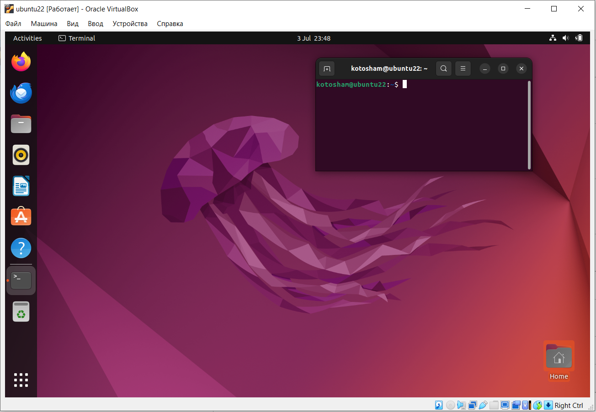
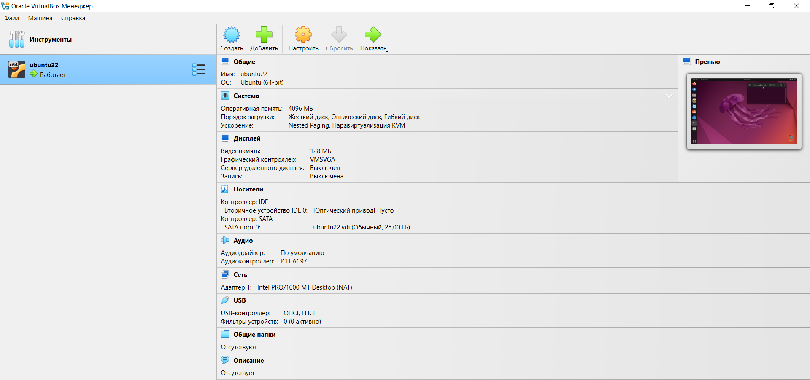

## 1. VM Deployment
### 1. Installing VirtualBox
Версия VirtualBox: 7.1.10  
### 2. Deploy a Virtual Machine
Была скачана Ubuntu 22.04 LTS, затем создана ВМ в VirtualBox:
- Тип: Linux
- Версия: Ubuntu (64-bit)
- Ядра CPU: 1
- Память: 4096 MB
- Видеопамять: 128 МВ
- Жёсткий диск: 25 GB




## 2. System Information Tools
### 1. Processor, RAM, and Network Information
Processor:
```sh
sudo lshw -short -C cpu
```
```
H/W path          Device      Class       Description
=====================================================
/0/2                          processor   11th Gen Intel(R) Co
```
RAM:
```sh
free -h
```
```
               total        used        free      shared  buff/cache   available
Mem:           3.8Gi       1.0Gi       433Mi        58Mi       2.4Gi       2.5Gi
Swap:          2.6Gi       0.0Ki       2.6Gi
```
Network Information:
```sh
ip -brief address show
```
```
lo               UNKNOWN        127.0.0.1/8 ::1/128 
enp0s3           UP             10.0.2.15/24 fd17:625c:f037:2:fd16:b1f2:1937:feee/64 fd17:625c:f037:2:35f5:3b73:ab80:50c/64 fe80::b024:bcaa:7241:9f13/64
```
### 2. Operating System Specifications
Версия ОС:
```sh
lsb_release -a
```
```
Distributor ID:  Ubuntu
Description:  Ubuntu 22.04.5 LTS
Release:  22.04
Codename:  jammy
```
О ядре:
```sh
uname -a
```
```
Linux ubuntu22 6.8.0-60-generic #63~22.04.1-Ubuntu SMP PREEMPT_DYNAMIC Tue Apr 22 19:00:15 UTC 2 x86_64 x86_64 x86_64 GNU/Linux
```