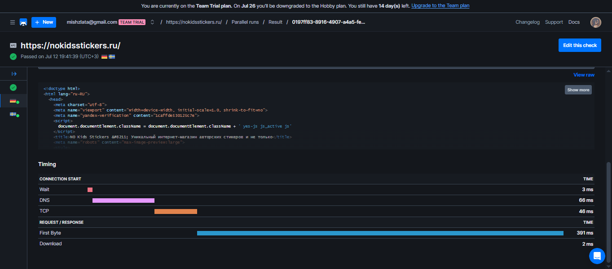

## 1. Key Metrics for SRE and SLAs
### 1. Monitor System Resources
```sh
htop
```
CPU:

Top-3: `gnome-shell`, `gnome-terminal-server`, `firefox`.

Memory:

Top-3: `gnome-shell` на всех первых позициях.

```sh
sudo iotop -oP
```

Top-3: `kworker~_unbound`, процессы `firefox`.

### 2. Disk Space Management
Общее использование диска:
```sh
df -h
```
```
Filesystem      Size  Used Avail Use% Mounted on
tmpfs           392M  1.6M  391M   1% /run
/dev/sda3        24G   15G  8.1G  65% /
tmpfs           2.0G     0  2.0G   0% /dev/shm
tmpfs           5.0M  4.0K  5.0M   1% /run/lock
/dev/sda2       512M  6.1M  506M   2% /boot/efi
tmpfs           392M   76K  392M   1% /run/user/128
tmpfs           392M  100K  392M   1% /run/user/1000
```
Поиск больших файлов /var (top-3):
```sh
sudo find /var -type f -exec du -h {} + 2>/dev/null | sort -rh | head -3
```
```
517M  /var/lib/snapd/snaps/gnome-42-2204_202.snap
506M  /var/lib/snapd/snaps/gnome-42-2204_176.snap
506M  /var/lib/snapd/seed/snaps/gnome-42-2204_176.snap
```

## 2. Practical Website Monitoring Setup
### 1. Choosing Website
https://nokidsstickers.ru/
### 2. Creating Checks in Checkly
API Check


Browser Check


### 3. Alerts


### 4. Capture Proof
Browser check


API Check

