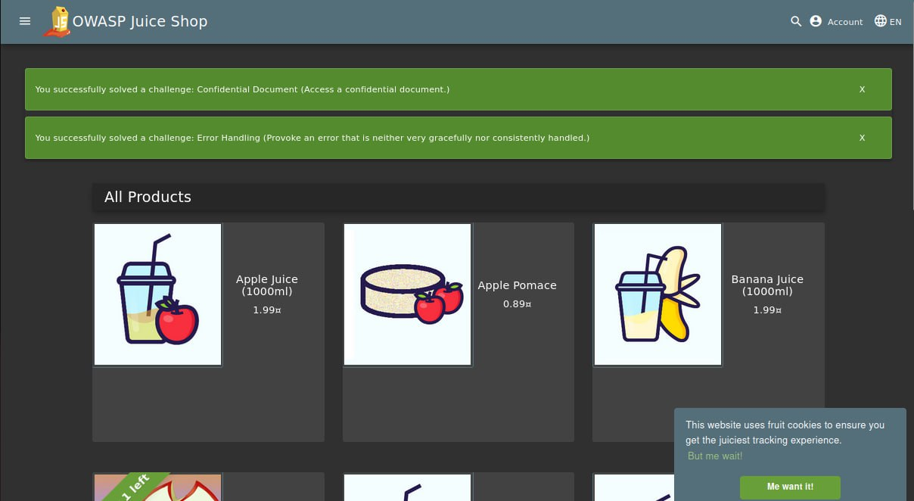
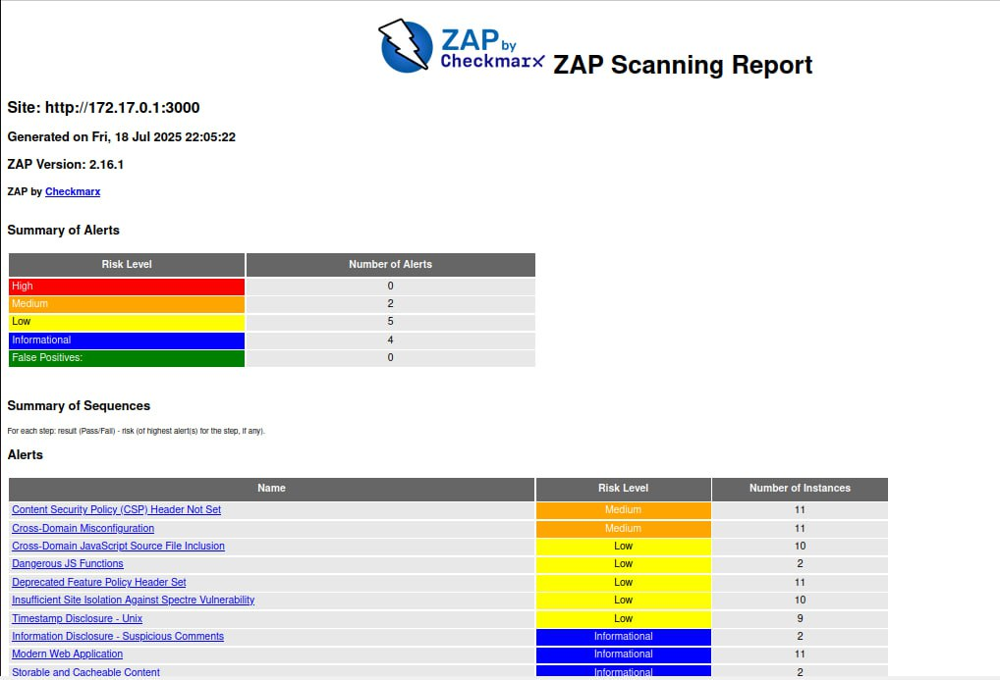

## 1. Web Application Scanning with OWASP ZAP
### 1. Start the vulnerable target application (Juice Shop)
```sh
docker run -d --name juice-shop -p 3000:3000 bkimminich/juice-shop
```

### 2. Scanning with OWASP ZAP
```sh
docker run --rm -u zap -v $(pwd):/zap/wrk:rw \
-t ghcr.io/zaproxy/zaproxy:stable zap-baseline.py \
-t http://host.docker.internal:3000 \
-g gen.conf \
-r zap-report.html
```
```
Total of 95 URLs
PASS: Vulnerable JS Library (Powered by Retire.js) [10003]
PASS: In Page Banner Information Leak [10009]
PASS: Cookie No HttpOnly Flag [10010]
PASS: Cookie Without Secure Flag [10011]
PASS: Re-examine Cache-control Directives [10015]
PASS: Content-Type Header Missing [10019]
PASS: Anti-clickjacking Header [10020]
PASS: X-Content-Type-Options Header Missing [10021]
PASS: Information Disclosure - Debug Error Messages [10023]
PASS: Information Disclosure - Sensitive Information in URL [10024]
PASS: Information Disclosure - Sensitive Information in HTTP Referrer Header [10025]
PASS: HTTP Parameter Override [10026]
PASS: Information Disclosure - Suspicious Comments [10027]
PASS: Off-site Redirect [10028]
PASS: Cookie Poisoning [10029]
PASS: User Controllable Charset [10030]
PASS: User Controllable HTML Element Attribute (Potential XSS) [10031]
PASS: Viewstate [10032]
PASS: Directory Browsing [10033]
PASS: Heartbleed OpenSSL Vulnerability (Indicative) [10034]
PASS: Strict-Transport-Security Header [10035]
PASS: HTTP Server Response Header [10036]
PASS: Server Leaks Information via "X-Powered-By" HTTP Response Header Field(s) [10037]
PASS: X-Backend-Server Header Information Leak [10039]
PASS: Secure Pages Include Mixed Content [10040]
PASS: HTTP to HTTPS Insecure Transition in Form Post [10041]
PASS: HTTPS to HTTP Insecure Transition in Form Post [10042]
PASS: User Controllable JavaScript Event (XSS) [10043]
PASS: Big Redirect Detected (Potential Sensitive Information Leak) [10044]
PASS: Content Cacheability [10049]
PASS: Retrieved from Cache [10050]
PASS: X-ChromeLogger-Data (XCOLD) Header Information Leak [10052]
PASS: Cookie without SameSite Attribute [10054]
PASS: CSP [10055]
PASS: X-Debug-Token Information Leak [10056]
PASS: Username Hash Found [10057]
PASS: X-AspNet-Version Response Header [10061]
PASS: PII Disclosure [10062]
PASS: Hash Disclosure [10097]
PASS: Source Code Disclosure [10099]
PASS: Weak Authentication Method [10105]
PASS: Reverse Tabnabbing [10108]
PASS: Modern Web Application [10109]
PASS: Authentication Request Identified [10111]
PASS: Session Management Response Identified [10112]
PASS: Verification Request Identified [10113]
PASS: Script Served From Malicious Domain (polyfill) [10115]
PASS: Absence of Anti-CSRF Tokens [10202]
PASS: Private IP Disclosure [2]
PASS: Session ID in URL Rewrite [3]
PASS: Script Passive Scan Rules [50001]
PASS: Insecure JSF ViewState [90001]
PASS: Java Serialization Object [90002]
PASS: Sub Resource Integrity Attribute Missing [90003]
PASS: Charset Mismatch [90011]
PASS: Application Error Disclosure [90022]
PASS: WSDL File Detection [90030]
PASS: Loosely Scoped Cookie [90033]
WARN-NEW: Cross-Domain JavaScript Source File Inclusion [10017] x 10 
  http://172.17.0.1:3000/ (200 OK)
  http://172.17.0.1:3000/ (200 OK)
  http://172.17.0.1:3000 (200 OK)
  http://172.17.0.1:3000 (200 OK)
  http://172.17.0.1:3000/sitemap.xml (200 OK)
WARN-NEW: Content Security Policy (CSP) Header Not Set [10038] x 11 
  http://172.17.0.1:3000/ (200 OK)
  http://172.17.0.1:3000 (200 OK)
  http://172.17.0.1:3000/sitemap.xml (200 OK)
  http://172.17.0.1:3000/ftp (200 OK)
  http://172.17.0.1:3000/ftp/coupons_2013.md.bak (403 Forbidden)
WARN-NEW: Deprecated Feature Policy Header Set [10063] x 11 
  http://172.17.0.1:3000/ (200 OK)
  http://172.17.0.1:3000 (200 OK)
  http://172.17.0.1:3000/sitemap.xml (200 OK)
  http://172.17.0.1:3000/runtime.js (200 OK)
  http://172.17.0.1:3000/polyfills.js (200 OK)
WARN-NEW: Timestamp Disclosure - Unix [10096] x 9 
  http://172.17.0.1:3000/ (200 OK)
  http://172.17.0.1:3000/ (200 OK)
  http://172.17.0.1:3000/ (200 OK)
  http://172.17.0.1:3000 (200 OK)
  http://172.17.0.1:3000 (200 OK)
WARN-NEW: Cross-Domain Misconfiguration [10098] x 11 
  http://172.17.0.1:3000/ (200 OK)
  http://172.17.0.1:3000/robots.txt (200 OK)
  http://172.17.0.1:3000 (200 OK)
  http://172.17.0.1:3000/sitemap.xml (200 OK)
  http://172.17.0.1:3000/assets/public/favicon_js.ico (200 OK)
WARN-NEW: Dangerous JS Functions [10110] x 2 
  http://172.17.0.1:3000/vendor.js (200 OK)
  http://172.17.0.1:3000/main.js (200 OK)
WARN-NEW: Insufficient Site Isolation Against Spectre Vulnerability [90004] x 10 
  http://172.17.0.1:3000/ (200 OK)
  http://172.17.0.1:3000/ (200 OK)
  http://172.17.0.1:3000 (200 OK)
  http://172.17.0.1:3000 (200 OK)
  http://172.17.0.1:3000/sitemap.xml (200 OK)
FAIL-NEW: 0  FAIL-INPROG: 0  WARN-NEW: 7  WARN-INPROG: 0  INFO: 0  IGNORE: 0  PASS: 58
```
### 3. Analysis of results


### Task 1 Results
- Juice Shop vulnerabilities found (Medium): 2
- Most interesting vulnerability found: Content Security Policy (CSP) Header Not Set
- Security headers present: No

## 2. Container Vulnerability Scanning with Trivy
### 1. Scanning using Trivy in Docker
```sh
docker run --rm -v /var/run/docker.sock:/var/run/docker.sock \
aquasec/trivy:latest image \
--severity HIGH,CRITICAL \
bkimminich/juice-shop
```
```
Report Summary
┌──────────────────────────────────────────────────────────────────────────────────┬──────────┬─────────────────┬─────────┐
│                                      Target                                      │   Type   │ Vulnerabilities │ Secrets │
├──────────────────────────────────────────────────────────────────────────────────┼──────────┼─────────────────┼─────────┤
│ bkimminich/juice-shop (debian 12.11)                                             │  debian  │        1        │    -    │
├──────────────────────────────────────────────────────────────────────────────────┼──────────┼─────────────────┼─────────┤
│ juice-shop/build/package.json                                                    │ node-pkg │        0        │    -    │
├──────────────────────────────────────────────────────────────────────────────────┼──────────┼─────────────────┼─────────┤
│ juice-shop/frontend/package.json                                                 │ node-pkg │        0        │    -    │
├──────────────────────────────────────────────────────────────────────────────────┼──────────┼─────────────────┼─────────┤
│ juice-shop/node_modules/@adraffy/ens-normalize/package.json                      │ node-pkg │        0        │    -    │
├──────────────────────────────────────────────────────────────────────────────────┼──────────┼─────────────────┼─────────┤
│ juice-shop/node_modules/@babel/helper-string-parser/package.json                 │ node-pkg │        0        │    -    │
├──────────────────────────────────────────────────────────────────────────────────┼──────────┼─────────────────┼─────────┤
│ juice-shop/node_modules/@babel/helper-validator-identifier/package.json          │ node-pkg │        0        │    -    │
├──────────────────────────────────────────────────────────────────────────────────┼──────────┼─────────────────┼─────────┤
│ juice-shop/node_modules/@babel/parser/package.json                               │ node-pkg │        0        │    -    │
├──────────────────────────────────────────────────────────────────────────────────┼──────────┼─────────────────┼─────────┤
│ juice-shop/node_modules/@babel/types/package.json                                │ node-pkg │        0        │    -    │
├──────────────────────────────────────────────────────────────────────────────────┼──────────┼─────────────────┼─────────┤
│ juice-shop/node_modules/@dabh/diagnostics/package.json                           │ node-pkg │        0        │    -    │
├──────────────────────────────────────────────────────────────────────────────────┼──────────┼─────────────────┼─────────┤
│ juice-shop/node_modules/@ethereumjs/rlp/package.json                             │ node-pkg │        0        │    -    │
├──────────────────────────────────────────────────────────────────────────────────┼──────────┼─────────────────┼─────────┤
│ juice-shop/node_modules/@gar/promisify/package.json                              │ node-pkg │        0        │    -    │
├──────────────────────────────────────────────────────────────────────────────────┼──────────┼─────────────────┼─────────┤
│ juice-shop/node_modules/@isaacs/cliui/node_modules/ansi-regex/package.json       │ node-pkg │        0        │    -    │
├──────────────────────────────────────────────────────────────────────────────────┼──────────┼─────────────────┼─────────┤
│ juice-shop/node_modules/@isaacs/cliui/node_modules/emoji-regex/package.json      │ node-pkg │        0        │    -    │
├──────────────────────────────────────────────────────────────────────────────────┼──────────┼─────────────────┼─────────┤
│ juice-shop/node_modules/@isaacs/cliui/node_modules/string-width/package.json     │ node-pkg │        0        │    -    │
├──────────────────────────────────────────────────────────────────────────────────┼──────────┼─────────────────┼─────────┤
│ juice-shop/node_modules/@isaacs/cliui/node_modules/strip-ansi/package.json       │ node-pkg │        0        │    -    │
├──────────────────────────────────────────────────────────────────────────────────┼──────────┼─────────────────┼─────────┤
│ juice-shop/node_modules/@isaacs/cliui/package.json                               │ node-pkg │        0        │    -    │
├──────────────────────────────────────────────────────────────────────────────────┼──────────┼─────────────────┼─────────┤
.................................................
```
```
bkimminich/juice-shop (debian 12.11)
====================================
Total: 1 (HIGH: 1, CRITICAL: 0)

┌─────────┬───────────────┬──────────┬──────────┬───────────────────┬───────────────┬───────────────────────────────────────────────────────────┐
│ Library │ Vulnerability │ Severity │  Status  │ Installed Version │ Fixed Version │                           Title                           │
├─────────┼───────────────┼──────────┼──────────┼───────────────────┼───────────────┼───────────────────────────────────────────────────────────┤
│ libc6   │ CVE-2025-4802 │ HIGH     │ affected │ 2.36-9+deb12u10   │               │ glibc: static setuid binary dlopen may incorrectly search │
│         │               │          │          │                   │               │ LD_LIBRARY_PATH                                           │
│         │               │          │          │                   │               │ https://avd.aquasec.com/nvd/cve-2025-4802                 │
└─────────┴───────────────┴──────────┴──────────┴───────────────────┴───────────────┴───────────────────────────────────────────────────────────┘

Node.js (node-pkg)
==================
Total: 25 (HIGH: 17, CRITICAL: 8)

┌─────────────────────────────────────┬─────────────────────┬──────────┬──────────┬───────────────────┬──────────────────────────────┬──────────────────────────────────────────────────────────────┐
│               Library               │    Vulnerability    │ Severity │  Status  │ Installed Version │        Fixed Version         │                            Title                             │
├─────────────────────────────────────┼─────────────────────┼──────────┼──────────┼───────────────────┼──────────────────────────────┼──────────────────────────────────────────────────────────────┤
│ base64url (package.json)            │ NSWG-ECO-428        │ HIGH     │ fixed    │ 0.0.6             │ >=3.0.0                      │ Out-of-bounds Read                                           │
│                                     │                     │          │          │                   │                              │ https://hackerone.com/reports/321687                         │
├─────────────────────────────────────┼─────────────────────┤          │          ├───────────────────┼──────────────────────────────┼──────────────────────────────────────────────────────────────┤
│ braces (package.json)               │ CVE-2024-4068       │          │          │ 2.3.2             │ 3.0.3                        │ braces: fails to limit the number of characters it can       │
│                                     │                     │          │          │                   │                              │ handle                                                       │
│                                     │                     │          │          │                   │                              │ https://avd.aquasec.com/nvd/cve-2024-4068                    │
├─────────────────────────────────────┼─────────────────────┼──────────┤          ├───────────────────┼──────────────────────────────┼──────────────────────────────────────────────────────────────┤
│ crypto-js (package.json)            │ CVE-2023-46233      │ CRITICAL │          │ 3.3.0             │ 4.2.0                        │ crypto-js: PBKDF2 1,000 times weaker than specified in 1993  │
│                                     │                     │          │          │                   │                              │ and 1.3M times...                                            │
│                                     │                     │          │          │                   │                              │ https://avd.aquasec.com/nvd/cve-2023-46233                   │
├─────────────────────────────────────┼─────────────────────┼──────────┤          ├───────────────────┼──────────────────────────────┼──────────────────────────────────────────────────────────────┤
│ express-jwt (package.json)          │ CVE-2020-15084      │ HIGH     │          │ 0.1.3             │ 6.0.0                        │ Authorization bypass in express-jwt                          │
│                                     │                     │          │          │                   │                              │ https://avd.aquasec.com/nvd/cve-2020-15084                   │
├─────────────────────────────────────┼─────────────────────┤          │          ├───────────────────┼──────────────────────────────┼──────────────────────────────────────────────────────────────┤
│ http-cache-semantics (package.json) │ CVE-2022-25881      │          │          │ 3.8.1             │ 4.1.1                        │ http-cache-semantics: Regular Expression Denial of Service   │
│                                     │                     │          │          │                   │                              │ (ReDoS) vulnerability                                        │
│                                     │                     │          │          │                   │                              │ https://avd.aquasec.com/nvd/cve-2022-25881                   │
├─────────────────────────────────────┼─────────────────────┤          ├──────────┼───────────────────┼──────────────────────────────┼──────────────────────────────────────────────────────────────┤
│ ip (package.json)                   │ CVE-2024-29415      │          │ affected │ 2.0.1             │                              │ node-ip: Incomplete fix for CVE-2023-42282                   │
│                                     │                     │          │          │                   │                              │ https://avd.aquasec.com/nvd/cve-2024-29415                   │
├─────────────────────────────────────┼─────────────────────┼──────────┼──────────┼───────────────────┼──────────────────────────────┼──────────────────────────────────────────────────────────────┤
│ jsonwebtoken (package.json)         │ CVE-2015-9235       │ CRITICAL │ fixed    │ 0.1.0             │ 4.2.2                        │ nodejs-jsonwebtoken: verification step bypass with an        │
│                                     │                     │          │          │                   │                              │ altered token                                                │
│                                     │                     │          │          │                   │                              │ https://avd.aquasec.com/nvd/cve-2015-9235                    │
│                                     ├─────────────────────┼──────────┤          │                   ├──────────────────────────────┼──────────────────────────────────────────────────────────────┤
│                                     │ CVE-2022-23539      │ HIGH     │          │                   │ 9.0.0                        │ jsonwebtoken: Unrestricted key type could lead to legacy     │
│                                     │                     │          │          │                   │                              │ keys usagen                                                  │
│                                     │                     │          │          │                   │                              │ https://avd.aquasec.com/nvd/cve-2022-23539                   │
│                                     ├─────────────────────┤          │          │                   ├──────────────────────────────┼──────────────────────────────────────────────────────────────┤
│                                     │ NSWG-ECO-17         │          │          │                   │ >=4.2.2                      │ Verification Bypass                                          │
│                                     ├─────────────────────┼──────────┤          ├───────────────────┼──────────────────────────────┼──────────────────────────────────────────────────────────────┤
│                                     │ CVE-2015-9235       │ CRITICAL │          │ 0.4.0             │ 4.2.2                        │ nodejs-jsonwebtoken: verification step bypass with an        │
│                                     │                     │          │          │                   │                              │ altered token                                                │
│                                     │                     │          │          │                   │                              │ https://avd.aquasec.com/nvd/cve-2015-9235                    │
│                                     ├─────────────────────┼──────────┤          │                   ├──────────────────────────────┼──────────────────────────────────────────────────────────────┤
│                                     │ CVE-2022-23539      │ HIGH     │          │                   │ 9.0.0                        │ jsonwebtoken: Unrestricted key type could lead to legacy     │
│                                     │                     │          │          │                   │                              │ keys usagen                                                  │
│                                     │                     │          │          │                   │                              │ https://avd.aquasec.com/nvd/cve-2022-23539                   │
│                                     ├─────────────────────┤          │          │                   ├──────────────────────────────┼──────────────────────────────────────────────────────────────┤
│                                     │ NSWG-ECO-17         │          │          │                   │ >=4.2.2                      │ Verification Bypass                                          │
├─────────────────────────────────────┼─────────────────────┤          │          ├───────────────────┼──────────────────────────────┼──────────────────────────────────────────────────────────────┤
│ jws (package.json)                  │ CVE-2016-1000223    │          │          │ 0.2.6             │ >=3.0.0                      │ Forgeable Public/Private Tokens                              │
│                                     │                     │          │          │                   │                              │ https://avd.aquasec.com/nvd/cve-2016-1000223                 │
├─────────────────────────────────────┼─────────────────────┼──────────┤          ├───────────────────┼──────────────────────────────┼──────────────────────────────────────────────────────────────┤
│ lodash (package.json)               │ CVE-2019-10744      │ CRITICAL │          │ 2.4.2             │ 4.17.12                      │ nodejs-lodash: prototype pollution in defaultsDeep function  │
│                                     │                     │          │          │                   │                              │ leading to modifying properties                              │
│                                     │                     │          │          │                   │                              │ https://avd.aquasec.com/nvd/cve-2019-10744                   │
│                                     ├─────────────────────┼──────────┤          │                   ├──────────────────────────────┼──────────────────────────────────────────────────────────────┤
│                                     │ CVE-2018-16487      │ HIGH     │          │                   │ >=4.17.11                    │ lodash: Prototype pollution in utilities function            │
│                                     │                     │          │          │                   │                              │ https://avd.aquasec.com/nvd/cve-2018-16487                   │
│                                     ├─────────────────────┤          │          │                   ├──────────────────────────────┼──────────────────────────────────────────────────────────────┤
│                                     │ CVE-2021-23337      │          │          │                   │ 4.17.21                      │ nodejs-lodash: command injection via template                │
│                                     │                     │          │          │                   │                              │ https://avd.aquasec.com/nvd/cve-2021-23337                   │
├─────────────────────────────────────┼─────────────────────┤          ├──────────┼───────────────────┼──────────────────────────────┼──────────────────────────────────────────────────────────────┤
│ lodash.set (package.json)           │ CVE-2020-8203       │          │ affected │ 4.3.2             │                              │ nodejs-lodash: prototype pollution in zipObjectDeep function │
│                                     │                     │          │          │                   │                              │ https://avd.aquasec.com/nvd/cve-2020-8203                    │
├─────────────────────────────────────┼─────────────────────┼──────────┤          ├───────────────────┼──────────────────────────────┼──────────────────────────────────────────────────────────────┤
│ marsdb (package.json)               │ GHSA-5mrr-rgp6-x4gr │ CRITICAL │          │ 0.6.11            │                              │ Command Injection in marsdb                                  │
│                                     │                     │          │          │                   │                              │ https://github.com/advisories/GHSA-5mrr-rgp6-x4gr            │
├─────────────────────────────────────┼─────────────────────┼──────────┼──────────┼───────────────────┼──────────────────────────────┼──────────────────────────────────────────────────────────────┤
│ moment (package.json)               │ CVE-2017-18214      │ HIGH     │ fixed    │ 2.0.0             │ 2.19.3                       │ nodejs-moment: Regular expression denial of service          │
│                                     │                     │          │          │                   │                              │ https://avd.aquasec.com/nvd/cve-2017-18214                   │
│                                     ├─────────────────────┤          │          │                   ├──────────────────────────────┼──────────────────────────────────────────────────────────────┤
│                                     │ CVE-2022-24785      │          │          │                   │ 2.29.2                       │ Moment.js: Path traversal in moment.locale                   │
│                                     │                     │          │          │                   │                              │ https://avd.aquasec.com/nvd/cve-2022-24785                   │
├─────────────────────────────────────┼─────────────────────┤          │          ├───────────────────┼──────────────────────────────┼──────────────────────────────────────────────────────────────┤
│ sanitize-html (package.json)        │ CVE-2022-25887      │          │          │ 1.4.2             │ 2.7.1                        │ sanitize-html: insecure global regular expression            │
│                                     │                     │          │          │                   │                              │ replacement logic may lead to ReDoS                          │
│                                     │                     │          │          │                   │                              │ https://avd.aquasec.com/nvd/cve-2022-25887                   │
├─────────────────────────────────────┼─────────────────────┼──────────┤          ├───────────────────┼──────────────────────────────┼──────────────────────────────────────────────────────────────┤
│ vm2 (package.json)                  │ CVE-2023-32314      │ CRITICAL │          │ 3.9.17            │ 3.9.18                       │ vm2: Sandbox Escape                                          │
│                                     │                     │          │          │                   │                              │ https://avd.aquasec.com/nvd/cve-2023-32314                   │
│                                     ├─────────────────────┤          ├──────────┤                   ├──────────────────────────────┼──────────────────────────────────────────────────────────────┤
│                                     │ CVE-2023-37466      │          │ affected │                   │                              │ vm2: Promise handler sanitization can be bypassed allowing   │
│                                     │                     │          │          │                   │                              │ attackers to escape the...                                   │
│                                     │                     │          │          │                   │                              │ https://avd.aquasec.com/nvd/cve-2023-37466                   │
│                                     ├─────────────────────┤          │          │                   ├──────────────────────────────┼──────────────────────────────────────────────────────────────┤
│                                     │ CVE-2023-37903      │          │          │                   │                              │ vm2: custom inspect function allows attackers to escape the  │
│                                     │                     │          │          │                   │                              │ sandbox and run...                                           │
│                                     │                     │          │          │                   │                              │ https://avd.aquasec.com/nvd/cve-2023-37903                   │
├─────────────────────────────────────┼─────────────────────┼──────────┼──────────┼───────────────────┼──────────────────────────────┼──────────────────────────────────────────────────────────────┤
│ ws (package.json)                   │ CVE-2024-37890      │ HIGH     │ fixed    │ 7.4.6             │ 5.2.4, 6.2.3, 7.5.10, 8.17.1 │ nodejs-ws: denial of service when handling a request with    │
│                                     │                     │          │          │                   │                              │ many HTTP headers...                                         │
│                                     │                     │          │          │                   │                              │ https://avd.aquasec.com/nvd/cve-2024-37890                   │
└─────────────────────────────────────┴─────────────────────┴──────────┴──────────┴───────────────────┴──────────────────────────────┴──────────────────────────────────────────────────────────────┘

/juice-shop/build/lib/insecurity.js (secrets)
=============================================
Total: 1 (HIGH: 1, CRITICAL: 0)
```
### Task 2 Results
- Critical vulnerabilities in Juice Shop image: 8
- Vulnerable packages: 
   1. bkimminich/juice-shop
   2. node-pkg
- Dominant vulnerability type: CVE, NSWG-ECO